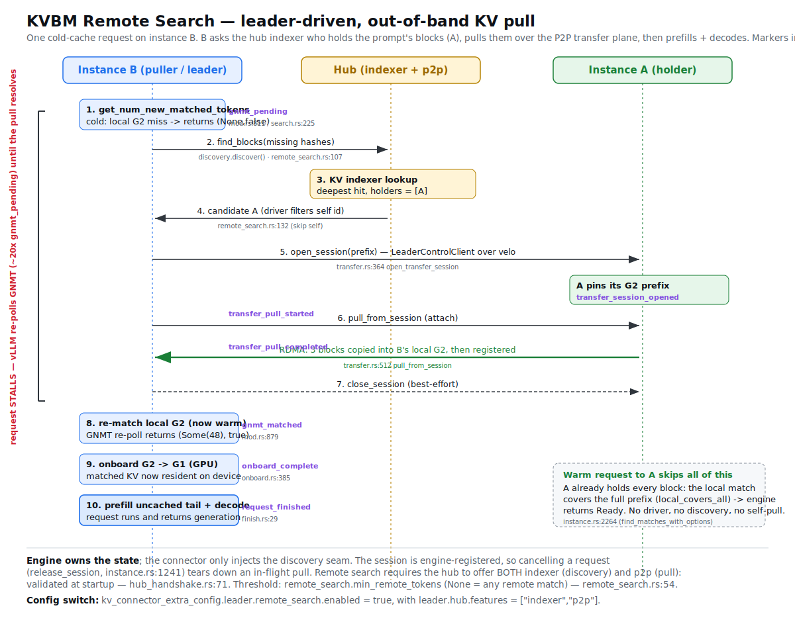

# KVBM Remote Search — bring up the smoke by hand

Goal: stand up the remote-search path manually with explicit commands (no smoke-skill wrappers),
drive it, and read the trace that proves it works.

**What it does:** a KVBM instance, on a cold-cache request, asks the **hub's KV indexer** which
*other* instance already holds the prompt's KV blocks, opens a **transfer session** on that holder,
and **RDMA-pulls** the blocks into its own local cache instead of recomputing them. The request
**stalls** on the search/pull, then prefills the uncached tail + decodes.

You'll run: **hub** (indexer + p2p) + **two aggregated vLLM instances A and B**. Warm A → it
computes + indexes its blocks. Hit B cold with the same prompt → B finds A, pulls A's blocks,
decodes. Same output, no recompute.

### Flow at a glance



The request lifecycle on B with every `kvbm_audit` marker and `file:line` annotated (source:
`assets/img/remote-search-flow.svg`). The §"How it works" table below is the same content in prose.

---

## Prereqs

- Linux + NVIDIA GPU(s), CUDA toolkit at `/usr/local/cuda`. Model is Qwen3-0.6B (tiny).
- A built `.sandbox` venv at the repo root (torch / vLLM nightly / nixl). If it's missing, build it
  once: `/kvbm-sandbox-venv --fresh` (slow, one-time).
- `REPO=` your worktree root. Everything below is relative to it.

```bash
REPO=$(pwd)            # run from the worktree root
LOGS=/tmp/rs           # where logs + trace land
mkdir -p "$LOGS"
```

---

## Build (2 artifacts)

**1. The connector Python extension** (what vLLM loads). Rebuild after any Rust change in
`kvbm-connector` / `kvbm-engine` / `kvbm-config`:

```bash
source "$REPO/.sandbox/bin/activate"
export CUDA_PATH=/usr/local/cuda CUDA_HOME=/usr/local/cuda PATH=/usr/local/cuda/bin:$PATH KVBM_REQUIRE_CUDA=1
( cd "$REPO" && maturin develop --release )
# maturin's pip step downgrades nccl to satisfy vLLM's pin; restore it:
uv pip install --force-reinstall --no-deps 'nvidia-nccl-cu13>=2.29'
```
Success = `🛠 Installed kvbm-1.2.0`. (A `patchelf` rpath warning is fine — `LD_LIBRARY_PATH` below
covers nixl.)

**2. The hub binary** (release):

```bash
cargo build -p kvbm-hub --bin kvbm_hub --release
```

---

## Run

Four terminals. Each `tee`s to a log file in `$LOGS` **and** your screen — the trace renderer reads
`hub.log`, `instance_a.log`, `instance_b.log` from that dir.

Shared connector config (identical for A and B) — this is the whole feature switch
(`remote_search.enabled: true`, hub features `indexer` + `p2p`):

```bash
export NIXL=$(ls -d "$REPO"/.sandbox/lib/python*/site-packages/.nixl_cu1*.mesonpy.libs | head -1)
export KVCFG='{"kv_connector":"KvbmConnector","kv_role":"kv_both","kv_load_failure_policy":"recompute","kv_connector_module_path":"kvbm.vllm.connector","kv_connector_extra_config":{"default":{"block_layout":"operational"},"leader":{"hub":{"url":"http://127.0.0.1:1337","features":["indexer","p2p"]},"max_seq_len":1024,"cache":{"host":{"cache_size_gb":2.0}},"remote_search":{"enabled":true}},"worker":{"nixl":{"backends":{"UCX":{},"POSIX":{}}}}}}'
```

### Terminal 0 — hub (indexer + p2p)

```bash
RUST_LOG=info,kvbm_hub=info "$REPO"/target/release/kvbm_hub \
  --discovery-port 1337 --control-port 8337 --velo-port 1338 \
  --block-size 16 --max-seq-len 1024 --layout operational \
  --kv-index-advertise-host 127.0.0.1 \
  --features indexer,p2p --g2-memory 4 \
  2>&1 | tee "$LOGS/hub.log"
```
Wait until `curl -s http://127.0.0.1:8337/health` returns `ok`.

### Terminal 1 — instance A (GPU 0, port 8000)

```bash
source "$REPO/.sandbox/bin/activate"
CUDA_VISIBLE_DEVICES=0 \
DYN_KVBM_CPU_CACHE_GB=2 VLLM_ATTENTION_BACKEND=FLASH_ATTN KVBM_SKIP_VLLM_VERSION_CHECK=1 \
LD_LIBRARY_PATH="$NIXL:$NIXL/plugins" NIXL_PLUGIN_DIR="$NIXL/plugins" \
RUST_LOG=info,kvbm_connector=debug,kvbm_engine=debug,kvbm_audit=info \
python3 -m vllm.entrypoints.openai.api_server \
  --model Qwen/Qwen3-0.6B --served-model-name Qwen/Qwen3-0.6B \
  --max-num-seqs 8 --gpu-memory-utilization 0.9 \
  --enable-chunked-prefill --no-enable-prefix-caching \
  --port 8000 --block-size 16 --max-model-len 1024 \
  --kv-transfer-config "$KVCFG" \
  2>&1 | tee "$LOGS/instance_a.log"
```
Ready when `curl -s http://127.0.0.1:8000/v1/models` succeeds. In the log you should see
`standalone P2P participation registered with hub`, `remote-search discovery injected into leader`,
and `indexer publisher wired`.

### Terminal 2 — instance B (GPU 1, port 8001)

Same as A, but **`CUDA_VISIBLE_DEVICES=1`**, **`--port 8001`**, tee to `instance_b.log`:

```bash
source "$REPO/.sandbox/bin/activate"
CUDA_VISIBLE_DEVICES=1 \
DYN_KVBM_CPU_CACHE_GB=2 VLLM_ATTENTION_BACKEND=FLASH_ATTN KVBM_SKIP_VLLM_VERSION_CHECK=1 \
LD_LIBRARY_PATH="$NIXL:$NIXL/plugins" NIXL_PLUGIN_DIR="$NIXL/plugins" \
RUST_LOG=info,kvbm_connector=debug,kvbm_engine=debug,kvbm_audit=info \
python3 -m vllm.entrypoints.openai.api_server \
  --model Qwen/Qwen3-0.6B --served-model-name Qwen/Qwen3-0.6B \
  --max-num-seqs 8 --gpu-memory-utilization 0.9 \
  --enable-chunked-prefill --no-enable-prefix-caching \
  --port 8001 --block-size 16 --max-model-len 1024 \
  --kv-transfer-config "$KVCFG" \
  2>&1 | tee "$LOGS/instance_b.log"
```

> Only one GPU? Put both on `CUDA_VISIBLE_DEVICES=0` and set `--gpu-memory-utilization 0.4` on each
> (the model is tiny, both fit easily).

### Terminal 3 — drive it

```bash
PROMPT='The quick brown fox jumps over the lazy dog and then keeps on running through the meadow until it reaches the river where it finally stops to drink some water and rest for a while before continuing its journey home through the forest path under a bright sky.'
req() { curl -m120 -sS -X POST "http://127.0.0.1:$1/v1/completions" -H 'Content-Type: application/json' \
  -d "{\"model\":\"Qwen/Qwen3-0.6B\",\"prompt\":\"$PROMPT\",\"max_tokens\":8,\"temperature\":0}" \
  | python3 -c 'import json,sys; print(json.load(sys.stdin)["choices"][0]["text"])'; }

req 8000   # req 1 → A : cold, A computes + offloads to its cache, blocks get indexed on the hub
req 8000   # req 2 → A : warm, A holds all blocks → MUST skip remote search (it's the golden output)
req 8001   # req 3 → B : cold locally → B remote-searches, finds A, pulls A's blocks, decodes
```

All three print the **same** text (greedy decode, `temperature=0`). req 3 matching req 2 proves the
*pulled* KV is correct, not just present. Expected here: `" This is the story of a fox that"`.

---

## Read the trace

The audit parser is **self-contained** (Python stdlib only). Point it at `$LOGS`:

```bash
python3 "$REPO/.claude/skills/disagg-trace/p2p-trace.py" "$LOGS"
# → writes $LOGS/trace.html  (3 lanes: A | Hub | B; click a request_id to filter)
```

For a quick text timeline of B's request without the HTML:

```bash
grep -aE 'kvbm_audit.*event="(gnmt_pending|gnmt_matched|transfer_pull_started|transfer_pull_completed|onboard_complete|request_finished)"' "$LOGS/instance_b.log" \
 | sed -E 's/.*([0-9]{2}:[0-9]{2}:[0-9]{2}\.[0-9]+).*event="([a-z_]+)"(.*)/\1  \2 \3/'
```

A passing B timeline (the real thing, captured on a GB10):

```
17:30:20.227  gnmt_pending           request="cmpl-…8e89ede4"          ← request STALLS: a find is in flight
17:30:20.231  transfer_pull_started  session=3f78… source=ab31…(= A)   ← RDMA pull from A begins
   …~20× gnmt_pending while vLLM re-polls and waits…
17:30:20.249  transfer_pull_completed pulled=3                          ← 3 blocks landed in B's cache
17:30:20.250  gnmt_matched           matched_tokens=48 async_load=true  ← stall resolves to a match
17:30:20.251  onboard_complete       ok=true                           ← KV copied to GPU; request runnable
17:30:20.312  request_finished                                          ← remaining prefill + decode done
```

On **A** you'll see the holder side and the warm-skip:
```
grep -ac 'event="transfer_session_opened"' "$LOGS/instance_a.log"   # >= 1  (A serves B's pull)
grep -ac 'event="transfer_pull_started"'   "$LOGS/instance_a.log"   #   0   (A never pulls; it holds the blocks)
```

---

## How it works (and where the trace shows it)

Everything happens inside **one `get_num_new_matched_tokens` (GNMT) request lifecycle on B**. The
leader runs in vLLM's EngineCore subprocess; its `kvbm_audit` events land in the instance log (hence
`kvbm_audit=info` in `RUST_LOG`).

| Step | What | Trace marker (lane) | Code |
|---|---|---|---|
| 1 | vLLM calls GNMT; local cache is cold → there are remote blocks. GNMT returns `(None,false)`, vLLM **re-polls** (the stall). | `gnmt_pending` (B) | `crates/kvbm-connector/src/connector/leader/mod.rs:811` (GNMT), `:879` (audit); `…/search.rs:225` `process_match` |
| 2 | Engine spawns the remote-search driver. | (driver start) | `crates/kvbm-engine/src/leader/instance.rs:2204` `find_matches_with_options`; `:2267` `use_indexer_search`; `:2264` `local_covers_all` (warm short-circuit) |
| 3 | Driver asks the hub indexer who holds the missing hashes, **filters out its own id**, resolves the peer. | (hub RPC) | `crates/kvbm-engine/src/leader/remote_search.rs:107` `search`, `:132` self-filter; connector impl `…/connector/leader/remote_search.rs:38`; hub `crates/kvbm-hub/src/features/indexer/client.rs:59` `find_blocks` |
| 4 | `open_session` on A (holder pins its blocks) → `pull_from_session` RDMA-copies into B + registers → `close_session`. | `transfer_session_opened` (A); `transfer_pull_started` / `…_completed` (B) | `…/remote_search.rs:161` `pull_from`; engine `…/leader/control/modules/transfer.rs:364` `open_transfer_session`, `:512` `pull_from_session` |
| 5 | Driver re-matches local cache (now warm), marks the session `Complete`; next GNMT poll returns `(Some(n), true)`. | `gnmt_matched matched_tokens=…` (B) | `…/connector/leader/mod.rs:879` |
| 6 | KV copied cache→GPU. | `onboard_complete` (B) | `…/connector/leader/onboard.rs:385` |
| 7 | Request runs: prefill the uncached tail + decode. | `request_finished` (B) | `…/connector/leader/finish.rs:29` |

**Things to internalize:**
- **It stalls; it does not recompute cold.** `(None,false)` = "find still running" → vLLM re-polls
  each scheduler step. The run of `gnmt_pending` rows around the pull is that stall.
- **Engine owns the state; the connector just injects discovery.** Because the session is engine-
  registered, cancelling a request (`release_session`) cleanly tears down an in-flight pull
  (`…/leader/instance.rs:1241`).
- **A warm request skips remote search entirely.** If the local match already covers the whole
  prefix (`local_covers_all`), the engine returns `Ready` — no driver, no discovery, no self-pull.
  That's why req 2 → A shows zero pulls.
- **Both hub features are required.** Remote search needs `indexer` (discovery) **and** `p2p` (the
  pull). Enforced at startup: `…/connector/leader/hub_handshake.rs:71`
  `validate_remote_search_availability`.
- **Threshold.** `remote_search.min_remote_tokens`: omitted ⇒ "any remote match" (≥1 block);
  `N` ⇒ `⌈N/block_size⌉` blocks. `crates/kvbm-config/src/remote_search.rs:54`.

---

## If something's off

- A/B never serve `/v1/models` → read its log; usually a CUDA/import issue (rebuild the `.so` + the
  nccl re-bump) or the wrong `NIXL` path.
- B never pulls (`transfer_pull_completed` absent) → confirm both logged `standalone P2P
  participation registered` + `remote-search discovery injected`, and the hub serves `indexer,p2p`
  (`curl -s http://127.0.0.1:1337/v1/config`). If the hub lacked `p2p`, startup fails fast.
- Stale procs / port-in-use (`kvbm_hub` won't bind 1337/8337) → `pkill -9 -f kvbm_hub; pkill -9 -f
  vllm.entrypoints.openai` and retry.

## Mental model

> Indexer = **who** has the blocks. P2P transfer plane = **pull** them. Remote search wires those
> two together during GNMT and stalls the request until the KV is local. Warm requests skip it;
> cancellation tears it down; both features must be on the hub.
